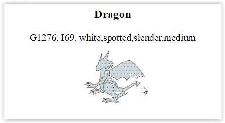
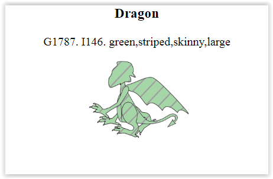
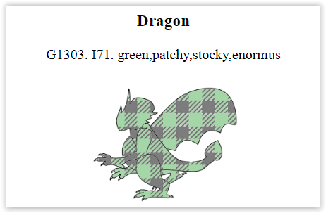
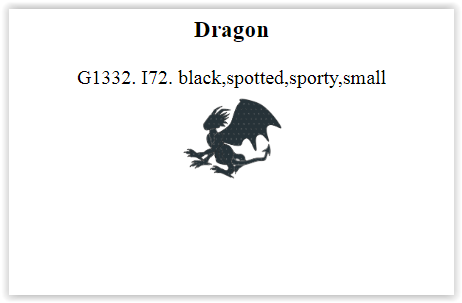
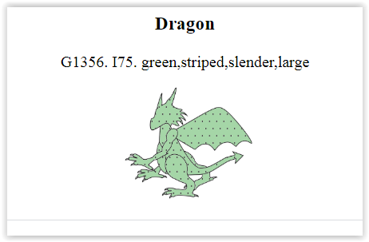
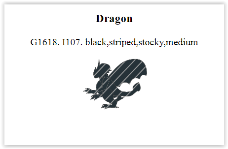
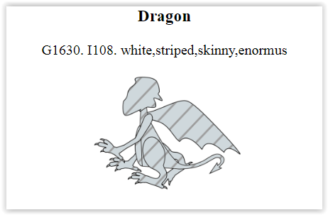
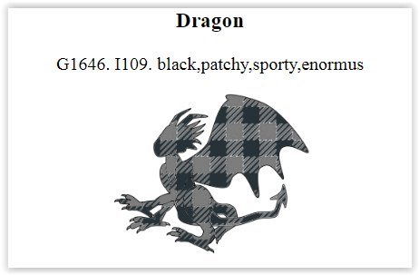
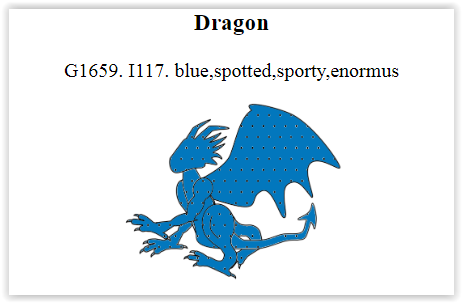

# DRAGON STACK

## Udemy course

https://www.udemy.com/course/full-stack/

### Collect more than mother of dragons ...

### Collect random dragon ...

### With random traits ...

|                                                                  |                                                                  |                                                                  |
| :--------------------------------------------------------------: | :--------------------------------------------------------------: | :--------------------------------------------------------------: |
|   |   |   |
|   |   |   |  |
|  |  |  |

### 4 diffrent colours, 4 diffrent builds, 4 diffrent sizes, 4 diffrent patterns

### makes 4x4x4x4 = 256 possible combinations

### every dragon comes from his generation, that makes your dragon more unique!
